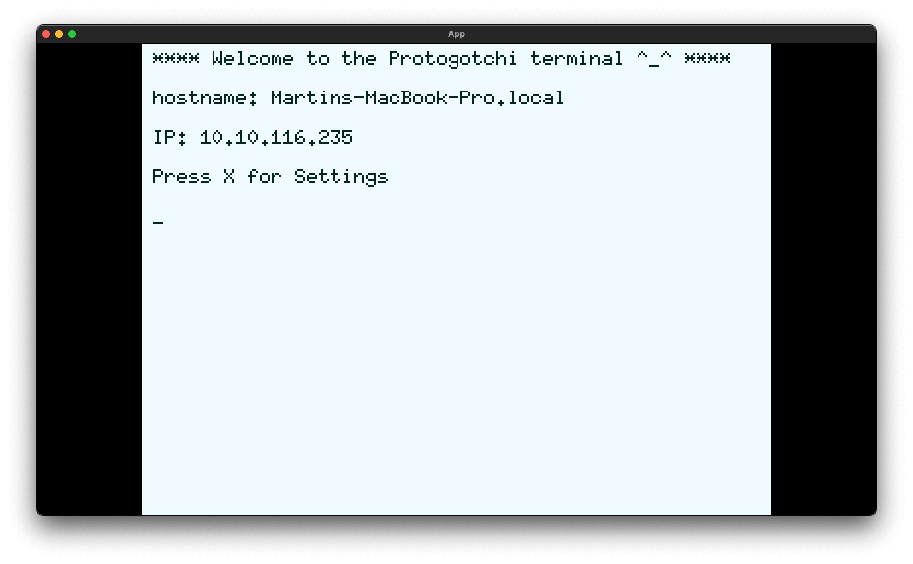
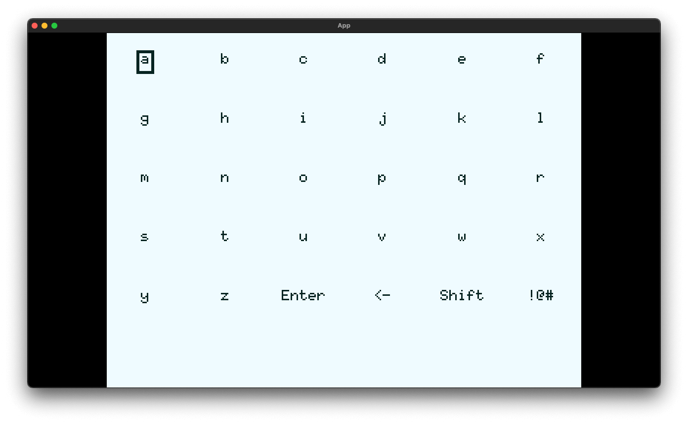

# Protogotchi

A virtual pet that fits in a Raspberry Pi with an LCD display.





## Build, strip, copy over SSH, and run

### Mac OS

Pre-requisite: musl-cross (Homebrew users: `brew install FiloSottile/musl-cross/musl-cross --without-x86_64 --with-arm-hf`)

https://github.com/FiloSottile/homebrew-musl-cross

```bash
printf "%s" "Protogotchi hostname: " && read PROTOG_HOSTNAME
printf "%s" "Protogotchi user: " && read PROSOG_USER
# build for rpi zero 2 w
cargo build --release --target=arm-unknown-linux-musleabihf
# look at the size of the bin file
ls -lh target/arm-unknown-linux-musleabihf/release/protogotchi
# strip it
arm-linux-musleabihf-strip target/arm-unknown-linux-musleabihf/release/protogotchi
# look at it now ;)
ls -lh target/arm-unknown-linux-musleabihf/release/protogotchi
# copy over ssh
scp target/arm-unknown-linux-musleabihf/release/protogotchi $PROTOG_USER@$PROTOG_HOSTNAME:~/
# ssh into the rpi to run it
ssh $PROSOG_USER@$PROTOG_HOSTNAME
# run it
./protogotchi
```

### Linux

Not tested. Follow this article [Raspberry Pi Zero Raspbian/Rust Primer](https://dev.to/jeikabu/raspberry-pi-zero-raspbian-rust-primer-3aj6).
